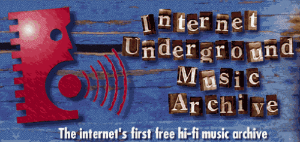

# 01 DE OCTUBRE DE 1993 Archivo de música clandestina de Internet (IUMA)

## Que fue? 
IUMA fue un sito web creado por Jeff Patterson, Jon Luini y Rob Lord, tres estudiantes de la Universidad de California en Santa Cruz.

## Objetivo de la web
Esta web fue fundada para que los artistas sin contrato pudieran subir su música y compartirla con sus fans. 
IUMA es reconocida como la cuna de la música en linea por muchos.

## Reavertura
A finales de  mayo de 2012, Jason Scott Sadofsky anunció que gran parte de la colección de IUMA se ha vuelto a publicar a través de Internet Archive  gracias a que John Gilmore habia recuperado los archivos sobrevivientes antes de su cierre. 
 

